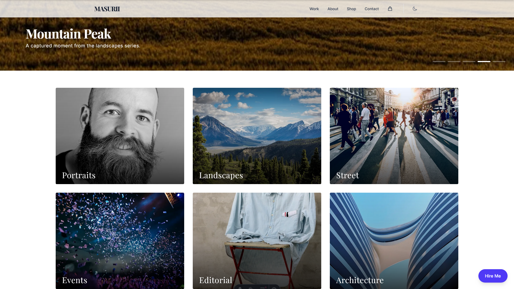

# Modern Photography Portfolio Template

<div align="center">


[](https://github.com/MasuRii/modernphotography-portfolio-template/actions/workflows/deploy.yml)
[](package.json)
[](CONTRIBUTING.md)

**A stunning, high-performance photography portfolio template built with Astro and Tailwind CSS. Perfect for photographers to showcase their work with style.**



[Live Demo](https://masurii.github.io/modernphotography-portfolio-template/) | [Documentation](#documentation) | [Quick Start](#quick-start)

</div>

---

## Features

- **Blazing Fast** - Built with Astro for optimal performance and minimal JavaScript
- **Image Optimized** - Sharp integration for automatic image optimization and LQIP placeholders
- **Gallery System** - Masonry grid layouts with category filtering (Portraits, Landscapes, Architecture, etc.)
- **Lightbox Viewer** - Full-screen image viewing with keyboard navigation
- **Print Shop** - Integrated shop functionality for selling prints
- **Shopping Cart** - Persistent cart with checkout flow
- **Dark/Light Mode** - Theme toggle with system preference detection
- **Fully Responsive** - Mobile-first design that looks great on all devices
- **SEO Optimized** - Built-in sitemap, meta tags, and Open Graph images
- **Accessibility First** - WCAG 2.1 AA compliant with keyboard navigation
- **Easy Customization** - JSON-based content management for quick updates

## Tech Stack

| Category             | Technology                                                              |
| -------------------- | ----------------------------------------------------------------------- |
| **Framework**        | [Astro](https://astro.build) v5.16.9                                    |
| **Styling**          | [Tailwind CSS](https://tailwindcss.com) v4.1.18                         |
| **Image Processing** | [Sharp](https://sharp.pixelplumbing.com) v0.34.5                        |
| **State Management** | [Nanostores](https://github.com/nanostores/nanostores)                  |
| **E2E Testing**      | [Playwright](https://playwright.dev) v1.57.0                            |
| **Deployment**       | [GitHub Pages](https://pages.github.com) / [Vercel](https://vercel.com) |

## Quick Start

### Prerequisites

- [Bun](https://bun.sh) (recommended) or [Node.js](https://nodejs.org) 18+
- [Git](https://git-scm.com)

### Installation

```bash
# Clone the repository
git clone https://github.com/MasuRii/modernphotography-portfolio-template.git
cd modernphotography-portfolio-template

# Install dependencies
bun install  # or npm install

# Start development server
bun dev  # or npm run dev
```

The site will be available at `http://localhost:4321`

## Commands

All commands are run from the root of the project:

| Command                  | Description                                |
| ------------------------ | ------------------------------------------ |
| `bun install`            | Install dependencies                       |
| `bun dev`                | Start local dev server at `localhost:4321` |
| `bun build`              | Build production site to `./dist/`         |
| `bun preview`            | Preview production build locally           |
| `bun run lint`           | Run ESLint for code quality                |
| `bun run format`         | Run Prettier for code formatting           |
| `bun run typecheck`      | Run TypeScript type checking               |
| `bun run images:process` | Process and optimize gallery images        |

## Project Structure

```
modernphotography-portfolio-template/
├── public/                    # Static assets (favicon, robots.txt, og-image)
├── src/
│   ├── assets/               # Images and fonts
│   │   └── images/           # Gallery, shop, and about images
│   │       ├── gallery/      # Categorized gallery images
│   │       └── shop/         # Print product images
│   ├── components/
│   │   ├── demo/             # Demo mode components (banner, modal)
│   │   ├── footer/           # Site footer
│   │   ├── gallery/          # Gallery components (MasonryGrid, CategoryGrid)
│   │   ├── hero/             # Hero slider component
│   │   ├── lightbox/         # Lightbox viewer
│   │   ├── navigation/       # Header, mobile menu, CTA
│   │   ├── shop/             # Print cards, cart modal
│   │   └── ThemeToggle.astro # Dark/light mode toggle
│   ├── data/                 # JSON content files
│   │   ├── branding.json     # Template branding info
│   │   ├── gallery-images.json   # Gallery image data
│   │   ├── photographer.json # Photographer profile
│   │   ├── print-products.json   # Shop products
│   │   ├── social-links.json # Social media links
│   │   └── testimonials.json # Client testimonials
│   ├── layouts/              # Page layouts
│   │   └── BaseLayout.astro  # Main layout with SEO
│   ├── pages/                # Astro pages
│   │   ├── index.astro       # Home page
│   │   ├── about.astro       # About page
│   │   ├── contact.astro     # Contact page
│   │   ├── shop.astro        # Print shop
│   │   ├── checkout.astro    # Checkout page
│   │   └── gallery/          # Gallery category pages
│   ├── store/                # Nanostores state management
│   └── styles/               # Global CSS
├── tests/                    # E2E and unit tests
├── scripts/                  # Build and utility scripts
├── .github/workflows/        # GitHub Actions CI/CD
└── package.json
```

## Customization

### Content

Edit the JSON files in `src/data/` to update your portfolio content:

- **`photographer.json`** - Your name, bio, contact info, services
- **`gallery-images.json`** - Gallery images with categories and metadata
- **`print-products.json`** - Products available for purchase
- **`social-links.json`** - Social media profile links
- **`testimonials.json`** - Client reviews and testimonials
- **`branding.json`** - Template branding and attribution

### Images

1. Replace images in `src/assets/images/gallery/` with your photos
2. Run `bun run images:process` to optimize them
3. Update `src/data/gallery-images.json` with new image metadata

### Styling

The project uses Tailwind CSS with a custom design system. Key customization points:

- Colors and theme variables in `src/styles/global.css`
- Typography and spacing in component files
- Component-specific styles in their respective `.astro` files

## Deployment

This project supports both **GitHub Pages** and **Vercel** deployment:

### GitHub Pages (Automatic)

1. Push your code to GitHub
2. Enable GitHub Pages in repository settings (Settings → Pages → Source: GitHub Actions)
3. The included workflow will automatically build and deploy on every push to `main`
4. Your site will be available at `https://<username>.github.io/<repo-name>/`

### Vercel

1. Push your code to GitHub
2. Import the repository in [Vercel](https://vercel.com)
3. Deploy!

Or use the CLI:

```bash
bun run deploy  # if deploy script is configured
```

### Other Platforms

For other platforms, run `bun build` and deploy the `dist/` folder.

## Documentation

For detailed information on customizing your portfolio, refer to the [Customization](#customization) section above.

## Contributing

Contributions are welcome! Please read our contributing guidelines before submitting a pull request.

We follow:

- [Conventional Commits](https://www.conventionalcommits.org/) for commit messages
- ESLint and Prettier for code style

---

<div align="center">

**Built with love by [MasuRii](https://github.com/MasuRii)**

If you found this helpful, please consider giving it a star!

[](https://github.com/MasuRii/modernphotography-portfolio-template)

</div>
